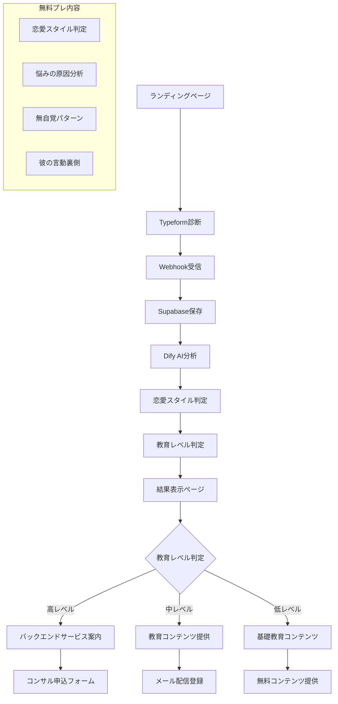

# 恋愛診断システム要件定義書（Typeform + Dify版）

## 📋 プロジェクト概要
- **プロジェクト名**: 恋愛診断&コンサルティングシステム（Typeform + Dify版）
- **開発期間**: 2週間（2024/08/09 - 2024/08/22）
- **開発手法**: Cursor + AI駆動開発
- **予算**: Typeform既契約、その他無料サービス中心
- **リリース日**: 2024年8月末
- **目的**: 3ヶ月の黒人生コンサル・コーチングサービスのフロントエンドとして、恋愛に悩む女性の教育レベルを測定し、適切な人をバックエンドサービスに導く

## 🎯 ビジネス要件
### ターゲットユーザー
- **メイン**: 恋愛に悩みを持つ20-50代女性
- **状況**: 恋愛がうまくいかない、彼との関係に悩んでいる、自己価値が低い
- **規模**: 月間200人利用想定
- **売上目標**: 月150万円（定単価×適切な顧客数）

### 商品構成
1. **無料診断**: 恋愛スタイル診断（集客・選別用）
   - 恋愛スタイル判定（依存型・自己否定、理想追求型、自己抑圧型）
   - 今の悩みが起きる理由
   - 無自覚な恋愛パターン
   - 彼の言動の裏側分析
2. **有料サービス**: 3ヶ月の黒人生コンサル・コーチング（バックエンド）

## 🏗️ 技術スタック

### **フロントエンド**
- **React**: UI（画面）を作るためのJavaScriptライブラリ
- **Next.js 14**: Reactベースのフレームワーク（フロントエンド・バックエンド両方）
- **TypeScript**: JavaScriptに型をつけて安全に開発
- **SHADCN UI**: デザインコンポーネントライブラリ
- **Tailwind CSS**: CSSフレームワーク（効率的なデザイン作成）
- **Framer Motion**: アニメーションライブラリ

### **バックエンド**
- **Next.js 14**: APIやサーバーサイド処理（フロントエンドと共通）
- **TypeScript**: バックエンド側でも型安全な開発

### **データベース・認証**
- **Supabase**: データベース、認証、ストレージ（無料枠あり）**← 確定**
- **Clerk**: ユーザー認証サービス（UI・バリデーション付き）

### **外部サービス**
- **Typeform**: 診断フォーム（既契約済み）**← 確定**
- **Dify**: AI診断結果生成・HTML出力
- **Stripe**: 決済サービス（サブスクリプション・課金機能）

### **開発支援・AI活用**
- **Cursor**: AIエディタ（AIとペアプログラミング）
- **Claude**: アイデア出し・要件定義・設計の壁打ち
- **Bolt**: フロントエンドデザインAIツール

### **デプロイ・ホスティング**
- **Vercel**: GitHub連携で簡単デプロイ

### **開発方針**
- **AI駆動開発**: Cursor + Claudeで効率的な開発
- **モダン技術**: 最新のWeb技術を活用
- **個人開発**: 個人でも素早くサービス作成・リリース可能

## 📱 システムアーキテクチャ


## 🔧 実装仕様

### 1. Typeform設定
```typescript
interface TypeformConfig {
  formId: string;
  questions: [
    {
      id: "q1",
      type: "multiple_choice",
      title: "あなたの年齢を教えてください",
      options: ["〜19歳", "20〜24歳", "25〜29歳", "30〜35歳", "36〜39歳", "40歳以上", "50歳以上"]
    },
    {
      id: "q2", 
      type: "multiple_choice",
      title: "あなたの悩みに近いものを教えてください",
      options: ["片思い中", "遠距離", "復縁をしたい", "不倫関係にある", "別れそうな彼がいる", "曖昧な関係"]
    },
    {
      id: "q3",
      type: "multiple_choice_with_text",
      title: "どんなことに1番悩んでいますか？",
      options: [
        "LINEの頻度や彼の態度が冷たい",
        "嫌われたくなくて本音が言えない", 
        "彼がどう思っているのか分からない",
        "尽くしすぎて疲れる",
        "なんでいつも恋愛が上手くいかないのか分からない"
      ],
      allow_other: true
    },
    {
      id: "q4",
      type: "multiple_choice_with_text", 
      title: "あなたの性格に近いものを教えてください",
      options: [
        "感情を抑えて我慢することが多い",
        "嫌われないように頑張りすぎる",
        "こうあるべきだという理想が強い",
        "気づいたら相手中心になっている",
        "気を使いすぎて疲れやすい"
      ],
      allow_other: true
    },
    {
      id: "q5",
      type: "multiple_choice",
      title: "今後について、私達があなたにできることが何かを教えてください",
      multiple_selection: true,
      options: [
        "自分の恋愛傾向を知りたい",
        "今の彼との関係を改善したい", 
        "自信を持って恋愛できるようになりたい",
        "相談できる人がほしい",
        "自分自身への向き合い方を知りたい"
      ]
    },
    {
      id: "q6",
      type: "multiple_choice",
      title: "1年間で「美容・自分磨き」に使っている金額の目安を教えてください",
      options: [
        "0円〜5万円（ほとんど使っていない）",
        "5万〜10万円（最低限だけ）",
        "10万〜20万円（必要なものには使う）",
        "20万〜50万円（自分を磨くことには前向き）",
        "50万円以上（魅力のためなら惜しまない）"
      ]
    },
    {
      id: "q7",
      type: "multiple_choice", 
      title: "彼のために、惜しまずお金や時間を使うことがありますか？",
      multiple_selection: true,
      options: [
        "気づけば色々やっていることが多い",
        "プレゼント、ご飯代など積極的に出す",
        "相手の都合で自分の予定を後回しにする",
        "嫌われたくないのでついやってしまう",
        "いいえ、自分を大事にしています"
      ]
    },
    {
      id: "q8",
      type: "short_text",
      title: "彼について教えてください（1）: 彼の年齢は？"
    },
    {
      id: "q9", 
      type: "short_text",
      title: "彼について教えてください（2）: 付き合ってからどのくらいですか？"
    },
    {
      id: "q10",
      type: "long_text", 
      title: "彼について教えてください（3）: 最近気になる彼の言動があれば教えてください"
    }
  ];
  webhook: {
    url: "https://your-domain.vercel.app/api/typeform-webhook";
    method: "POST";
  };
}
```

### 2. Webhook処理システム
```typescript
// api/typeform-webhook.ts
interface TypeformWebhookPayload {
  event_id: string;
  event_type: "form_response";
  form_response: {
    form_id: string;
    token: string;
    submitted_at: string;
    definition: FormDefinition;
    answers: Answer[];
  };
}

interface Answer {
  field: {
    id: string;
    type: string;
    ref: string;
  };
  type: string;
  text?: string;
  choice?: {
    label: string;
    other?: string;
  };
  number?: number;
}

export default async function handler(req: NextRequest) {
  const payload: TypeformWebhookPayload = req.body;
  
  // 1. 回答データを構造化
  const structuredAnswers = processTypeformAnswers(payload.form_response.answers);
  
  // 2. Supabaseに保存
  const { data: user } = await supabase
    .from('diagnosis_results')
    .insert({
      typeform_response_id: payload.form_response.token,
      answers: structuredAnswers,
      created_at: new Date().toISOString()
    })
    .select()
    .single();
    
  // 3. Dify AI分析実行
  const difyResult = await analyzeDiagnosis(structuredAnswers);
  
  // 4. 結果をデータベース更新
  await supabase
    .from('diagnosis_results')
    .update({
      result_type: difyResult.diagnosis_type,
      ai_analysis_html: difyResult.html_output, // HTML形式
      analysis_complete: true
    })
    .eq('id', user.id);
    
  // 5. ユーザーに結果ページURL通知（メール/LINE等）
  await notifyUserResult(user.id);
  
  return Response.json({ success: true });
}
```

### 3. Dify連携
```typescript
interface DifyAnalysisRequest {
  inputs: {
    user_answers: StructuredAnswer[];
    output_format: "html";
    character_limit: 1500;
  };
  response_mode: "blocking";
  user: string;
}

interface DifyAnalysisResponse {
  answer: string; // HTML形式のレスポンス
  metadata: {
    education_level: "高レベル" | "中レベル" | "低レベル";
    confidence_score: number;
    love_style: "依存型・自己否定" | "理想追求型" | "自己抑圧型";
    category_scores: {
      self_investment: number;     // 自己投資スコア（Q6）
      relationship_awareness: number; // 関係性認識スコア（Q3, Q4）
      growth_mindset: number;      // 成長マインドセットスコア（Q5）
      self_worth: number;          // 自己価値スコア（Q7）
      problem_analysis: number;    // 問題分析スコア（Q3, Q10）
    };
    recommended_next_step: string; // 推奨次のステップ
  };
}

const analyzeDiagnosis = async (answers: StructuredAnswer[]): Promise<DifyAnalysisResponse> => {
  const response = await fetch(`${process.env.DIFY_API_ENDPOINT}/chat-messages`, {
    method: 'POST',
    headers: {
      'Authorization': `Bearer ${process.env.DIFY_API_KEY}`,
      'Content-Type': 'application/json'
    },
    body: JSON.stringify({
      inputs: {
        user_answers: answers,
        output_format: "html",
        character_limit: 2000,
        include_sections: [
          "あなたの教育レベル診断結果",
          "各カテゴリの詳細分析",
          "現在の課題と改善点",
          "次のステップの提案",
          "バックエンドサービスの案内（高レベル向け）"
        ],
        education_level_criteria: {
          "高レベル": "自己投資ができ、問題を具体的に分析でき、成長意欲が高い",
          "中レベル": "課題は認識しているが、解決方法が不明確で、自己投資が不十分",
          "低レベル": "現状認識が曖昧で、自己価値が低く、方向性が定まっていない"
        },
        love_style_analysis: {
          "依存型・自己否定": "相手中心で自己価値を低く見積もる傾向",
          "理想追求型": "完璧主義で理想を追い求める傾向", 
          "自己抑圧型": "感情を抑えて我慢しがちな傾向"
        },
        free_content_sections: [
          "恋愛スタイル（依存型・自己否定、理想追求型、自己抑圧型）",
          "今の悩みが起きる理由",
          "あなたが知らずに繰り返している「無自覚な恋愛パターン」",
          "あなたの気づいていない「彼の言動」の裏側"
        ]
      },
      response_mode: "blocking",
      user: `user_${Date.now()}`
    })
  });
  
  return response.json();
};
```

### 4. データベース設計（Supabase）
```sql
-- 診断結果テーブル
CREATE TABLE diagnosis_results (
  id UUID PRIMARY KEY DEFAULT gen_random_uuid(),
  typeform_response_id VARCHAR UNIQUE NOT NULL,
  answers JSONB NOT NULL, -- 構造化された回答
  education_level VARCHAR, -- 教育レベル（高/中/低）
  love_style VARCHAR, -- 恋愛スタイル（依存型・自己否定、理想追求型、自己抑圧型）
  category_scores JSONB, -- 各カテゴリのスコア
  ai_analysis_html TEXT, -- DifyからのHTML出力
  recommended_next_step VARCHAR, -- 推奨次のステップ
  analysis_complete BOOLEAN DEFAULT FALSE,
  created_at TIMESTAMP DEFAULT NOW(),
  updated_at TIMESTAMP DEFAULT NOW()
);

-- ユーザーテーブル（必要に応じて）
CREATE TABLE users (
  id UUID PRIMARY KEY DEFAULT gen_random_uuid(),
  email VARCHAR,
  diagnosis_id UUID REFERENCES diagnosis_results(id),
  created_at TIMESTAMP DEFAULT NOW()
);

-- コンサル申込テーブル
CREATE TABLE consultation_applications (
  id UUID PRIMARY KEY DEFAULT gen_random_uuid(),
  diagnosis_id UUID REFERENCES diagnosis_results(id),
  name VARCHAR NOT NULL,
  email VARCHAR NOT NULL,
  phone VARCHAR,
  education_level VARCHAR NOT NULL,
  current_challenges TEXT,
  expected_outcomes TEXT,
  application_status VARCHAR DEFAULT 'pending', -- pending, contacted, scheduled, completed
  created_at TIMESTAMP DEFAULT NOW()
);

-- メール配信登録テーブル
CREATE TABLE email_subscriptions (
  id UUID PRIMARY KEY DEFAULT gen_random_uuid(),
  diagnosis_id UUID REFERENCES diagnosis_results(id),
  email VARCHAR NOT NULL,
  education_level VARCHAR NOT NULL,
  subscription_status VARCHAR DEFAULT 'active',
  created_at TIMESTAMP DEFAULT NOW()
);

-- インデックス
CREATE INDEX idx_typeform_response ON diagnosis_results(typeform_response_id);
CREATE INDEX idx_analysis_complete ON diagnosis_results(analysis_complete);
```

### 5. フロントエンド構成（Next.js 14）
```
/
├── app/                    # App Router（Next.js 14）
│   ├── layout.tsx         # ルートレイアウト
│   ├── page.tsx           # ランディングページ
│   ├── diagnosis/
│   │   └── [id]/
│   │       ├── page.tsx   # 診断結果表示
│   │       └── apply/
│   │           └── page.tsx # コンサル申込フォーム
│   ├── subscribe/
│   │   └── page.tsx       # メール配信登録
│   └── globals.css        # グローバルスタイル
├── components/            # 再利用可能コンポーネント
│   ├── ui/               # SHADCN UIコンポーネント
│   ├── forms/            # フォームコンポーネント
│   ├── animations/       # Framer Motionアニメーション
│   └── layout/           # レイアウトコンポーネント
├── lib/                  # ユーティリティ・設定
│   ├── supabase.ts       # Supabase設定
│   ├── clerk.ts          # Clerk認証設定
│   ├── stripe.ts         # Stripe設定
│   └── utils.ts          # 共通ユーティリティ
├── app/api/              # API Routes
│   ├── typeform-webhook/
│   │   └── route.ts      # Webhook受信
│   ├── apply-consultation/
│   │   └── route.ts      # コンサル申込
│   └── subscribe-email/
│       └── route.ts      # メール配信登録
└── types/                # TypeScript型定義
    ├── diagnosis.ts      # 診断関連の型
    └── api.ts           # API関連の型
```

### 6. 結果表示ページ
```typescript
// pages/diagnosis/[id]/result.tsx
interface DiagnosisResultPage {
  resultId: string;
  
  async loadResult() {
    const { data } = await supabase
      .from('diagnosis_results')
      .select('*')
      .eq('id', this.resultId)
      .eq('analysis_complete', true)
      .single();
      
    if (!data) {
      // 分析中の場合はローディング表示
      return this.showAnalyzing();
    }
    
    // DifyからのHTML出力を直接表示
    document.getElementById('diagnosis-content').innerHTML = data.ai_analysis_html;
    
    // 教育レベルに応じた次のステップを表示
    this.showNextStep(data.education_level, data.id);
  },
  
  showNextStep(educationLevel: string, diagnosisId: string) {
    let nextStepHtml = '';
    
    switch(educationLevel) {
      case '高レベル':
        nextStepHtml = `
          <div class="next-step-section high-level">
            <h3>🎯 あなたは高レベルです！</h3>
            <p>具体的な行動計画をお持ちですね。次のステップとして、3ヶ月の人生コンサル・コーチングをご提案します。</p>
            <button onclick="applyConsultation('${diagnosisId}')" class="cta-button">
              コンサル申込フォームへ
            </button>
          </div>
        `;
        break;
        
      case '中レベル':
        nextStepHtml = `
          <div class="next-step-section medium-level">
            <h3>📚 あなたは中レベルです</h3>
            <p>課題は認識されていますが、解決方法を学ぶ必要がありますね。無料の教育コンテンツをお届けします。</p>
            <button onclick="subscribeEmail('${diagnosisId}')" class="cta-button">
              無料コンテンツを受け取る
            </button>
          </div>
        `;
        break;
        
      case '低レベル':
        nextStepHtml = `
          <div class="next-step-section low-level">
            <h3>🌱 あなたは低レベルです</h3>
            <p>まずは基礎から学びましょう。段階的に成長できる無料コンテンツをご用意しています。</p>
            <button onclick="getBasicContent('${diagnosisId}')" class="cta-button">
              基礎コンテンツを受け取る
            </button>
          </div>
        `;
        break;
    }
    
    document.getElementById('next-step-section').innerHTML = nextStepHtml;
  }
}
```

### 7. コンサル申込システム
```typescript
// api/apply-consultation.ts
export default async function handler(req: NextRequest) {
  const { diagnosisId, name, email, phone, currentChallenges, expectedOutcomes } = req.body;
  
  // 診断結果を取得
  const { data: diagnosis } = await supabase
    .from('diagnosis_results')
    .select('education_level')
    .eq('id', diagnosisId)
    .single();
    
  // コンサル申込を保存
  const { data: application } = await supabase
    .from('consultation_applications')
    .insert({
      diagnosis_id: diagnosisId,
      name,
      email,
      phone,
      education_level: diagnosis.education_level,
      current_challenges: currentChallenges,
      expected_outcomes: expectedOutcomes,
      application_status: 'pending'
    })
    .select()
    .single();
    
  // 管理者に通知メール送信
  await sendAdminNotification(application);
  
  // 申込者に確認メール送信
  await sendConfirmationEmail(email, name);
  
  return Response.json({ success: true, applicationId: application.id });
}

// api/subscribe-email.ts
export default async function handler(req: NextRequest) {
  const { diagnosisId, email } = req.body;
  
  // 診断結果を取得
  const { data: diagnosis } = await supabase
    .from('diagnosis_results')
    .select('education_level')
    .eq('id', diagnosisId)
    .single();
    
  // メール配信登録
  await supabase
    .from('email_subscriptions')
    .insert({
      diagnosis_id: diagnosisId,
      email,
      education_level: diagnosis.education_level,
      subscription_status: 'active'
    });
    
  // 教育レベルに応じたウェルカムメール送信
  await sendWelcomeEmail(email, diagnosis.education_level);
  
  return Response.json({ success: true });
}
```

## 📅 開発スケジュール

### Week 1 (8/9-8/15)
- [ ] **Day 1-2**: Next.js 14環境構築、Supabase設定、DB設計
- [ ] **Day 3-4**: Typeform作成（10問）+ Webhook設定
- [ ] **Day 5-6**: Webhook受信システム構築（Next.js API Routes）
- [ ] **Day 7**: Dify連携テスト

### Week 2 (8/16-8/22)
- [ ] **Day 1-2**: 結果表示ページ作成（React + SHADCN UI）
- [ ] **Day 3-4**: コンサル申込・メール配信システム構築
- [ ] **Day 5**: エラーハンドリング、セキュリティ、アニメーション
- [ ] **Day 6-7**: テスト、Vercelデプロイ、最終調整

## 🔒 セキュリティ要件
- **Webhook検証**: Typeform署名検証（確定）
- **Supabase RLS**: Row Level Security有効（確定）
- **環境変数**: 全API Key環境変数管理
- **CORS設定**: 適切なOrigin制限
- **入力値検証**: 全入力データサニタイズ
- **TypeScript**: 型安全な開発でランタイムエラー防止

## 🚀 環境変数設定
```bash
# .env.local
# Supabase（確定）
SUPABASE_URL=your_supabase_url
SUPABASE_ANON_KEY=your_supabase_anon_key
SUPABASE_SERVICE_ROLE_KEY=your_service_role_key

# Typeform（確定）
TYPEFORM_WEBHOOK_SECRET=your_typeform_webhook_secret
TYPEFORM_FORM_ID=your_typeform_form_id

# Dify（AI診断結果生成）
DIFY_API_ENDPOINT=your_dify_endpoint
DIFY_API_KEY=your_dify_api_key

# Stripe（決済）
STRIPE_PUBLISHABLE_KEY=your_stripe_pk
STRIPE_SECRET_KEY=your_stripe_sk

# Next.js
NEXT_PUBLIC_APP_URL=https://your-domain.vercel.app
```

## ✅ 完成後の確認項目
- [ ] Typeformから正常にWebhook送信される
- [ ] Difyで2000文字のHTML出力が生成される（恋愛スタイル判定含む）
- [ ] 結果ページでHTMLが正しく表示される
- [ ] 教育レベル判定が適切に動作する
- [ ] コンサル申込フォームが正常に動作する
- [ ] メール配信登録が正常に動作する
- [ ] スマホでの表示・操作に問題がない
- [ ] エラー処理が適切に動作する

## 🎯 教育レベル判定の重要ポイント

### **高レベル（バックエンドサービス案内）**
- **自己投資スコア**: 20万円以上（Q6）
- **成長マインドセット**: 複数の成長意欲項目を選択（Q5）
- **自己価値**: 「自分を大事にしています」を選択（Q7）
- **問題分析**: 具体的な悩みを自由記述で詳細に記載（Q3, Q10）

### **中レベル（教育コンテンツ提供）**
- **自己投資スコア**: 10-20万円（Q6）
- **成長マインドセット**: 1-2つの成長意欲項目を選択（Q5）
- **関係性認識**: 課題は認識しているが解決方法が不明確（Q3, Q4）

### **低レベル（基礎教育コンテンツ）**
- **自己投資スコア**: 5万円以下（Q6）
- **自己価値**: 相手中心の行動が多い（Q7）
- **問題認識**: 現状認識が曖昧（Q3, Q4）

## 💡 重要なポイント
1. **人の手を使わない**: 完全自動化で教育レベルを判定
2. **適切な選別**: 高レベルのみをバックエンドサービスに導く
3. **無料プレの価値**: 恋愛スタイル判定で信頼性を高める
4. **段階的アプローチ**: 教育レベルに応じた適切な次のステップ

---
*Typeformの美しいUXとDifyの強力なAI機能を組み合わせた効率的な開発を実現します。*